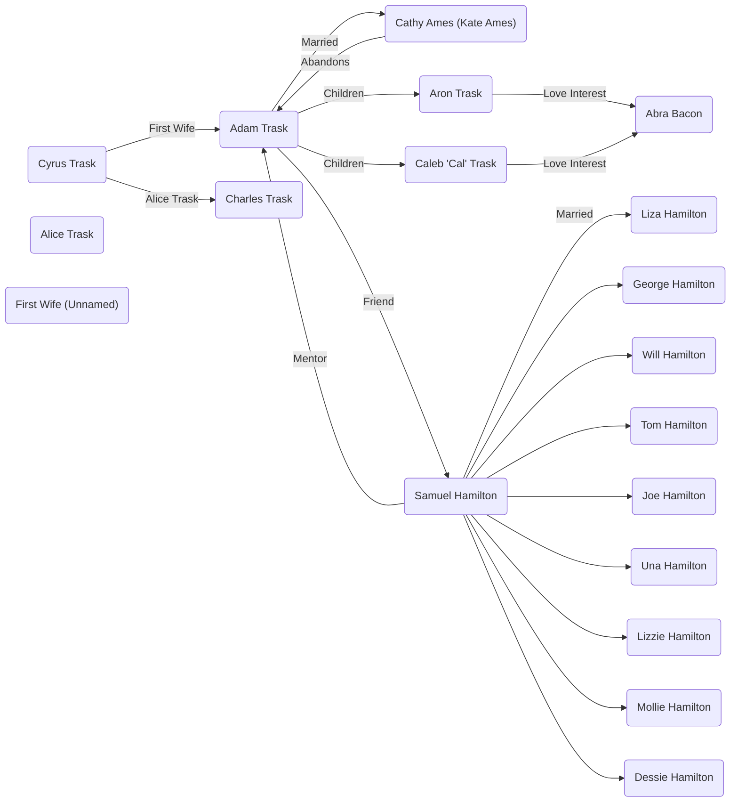

| نام اثر | شرق بهشت  |
| نویسنده | جان استاین‌بک |
| سال چاپ | ۱۹۵۲  |
| کشور | آمریکا |
| ژانر | رمان ادبی |
| امتیاز | ⭐⭐⭐⭐⭐⭐⭐☆☆☆ 7/10 |

[ورژن انگلیسی](https://www.fadedpage.com/books/20211110/html.php)

### شخصیت‌ها

خانواده تراسک

  
سایرس تراسک

پدر خانواده تراسک، یک کهنه‌سرباز جنگ داخلی با اخلاقیاتی سوال‌برانگیز.

  
آدام تراسک

پسر مهربان سایرس، مردی آرمان‌گرا که در درک مفهوم خوب و بد دچار مشکل است.

  
چارلز تراسک

برادر ناتنی آدام، اغلب حسود و خشن، و در تضاد با مهربانی آدام.

  
کَتی ایمز (بعدها کیت)

شخصیتی دست‌کاری‌گر و بدطینت که با آدام ازدواج می‌کند و تبدیل به ضدقهرمان اصلی داستان می‌شود.

  
آرون تراسک

پسر آرمان‌گرای آدام و کتی که با درک جنبه‌های تاریک زندگی دچار مشکل است.

  
کالب (کل) تراسک

برادر دوقلوی آرون، که شخصیت پیچیده‌تری دارد و از پتانسیل خود برای تاریکی آگاه است.

خانواده همیلتون

  
ساموئل همیلتون

یک مهاجر ایرلندی خردمند و مهربان که به دوست نزدیک آدام تراسک و مربی دیگران تبدیل می‌شود.

  
لیزا همیلتون

همسر منطقی و مذهبی ساموئل، که نیروی ثابتی در خانواده است.

  
تام همیلتون

پسر حساس و گرفتار ساموئل، که از عذاب وجدان و شک به خود رنج می‌برد.

  
اونا، ویل، دسی، الیو، جو و مالی همیلتون

فرزندان دیگر همیلتون، هر کدام با شخصیت‌ها و زندگی‌های متفاوت.

  
لی

خدمتکار وفادار چینی-آمریکایی آدام و محرم اسرار او، که به عنوان یک شخصیت پدرانه برای آرون و کل عمل می‌کند و اغلب بینش فلسفی ارائه می‌دهد.

  
ابرا بیکن

علاقه‌مند آرون، که در نهایت به کل نزدیک‌تر می‌شود و با چالش‌های اخلاقی خود روبرو می‌شود.

  
آقای ادواردز

رئیس سابق کتی و قربانی دستکاری‌های او.

### موضوع فصل‌ها

بخش اول

فصل اول

توضیح دره سالیناس

فصل دوم

 شروع تاریخچه خانواده همیلتون‌

 در حالی که بسیاری از مردم بدون پول به دره سالیناس آمدند، افراد دیگری نیز بودند که با فروش در جای دیگری، با پول برای شروع یک زندگی جدید وارد شدند. اینها معمولاً زمین می‌خریدند، اما زمین خوب، و خانه‌هایشان را از چوب تخته‌شده می‌ساختند و در پنجره‌هایشان فرش‌ها و شیشه‌های الماس رنگی داشتند. تعدادی از این خانواده ها بودند و به زمین خوب دره رسیدند و خردل زرد را پاک کردند و گندم کاشتند.

فصل سوم

 شروع تاریخچه خانواده تراسک
 خشونت چارلز در مقابل آدام
 تنهایی آدام در خانواده

فصل چهارم

آدام بدون خواسته خودش به سواره‌نظام ملحق شد.
چارلز گاهی اوقات برای او نامه می‌نوشت.

فصل پنجم

در مورد خانواده همیلتون.
ایرلندی بودند و تحقیر می‌شدند

جرج بچه خوب و آرامی بود.

ویل توانست خوب پول دربیاورد.

تام شبیه پدرش بود. دنیای درخشانی داشت. 
اندوهش هم مانند شادی‌اش هیجانی بود. 
مثل پدرش اهل اختراع بود.
مجرد ماند. 

تام و جوزف-جو و سامویل بلند نظر بودند
جرج و ویل کوتاه نظر بودند

جو احتیاج به کمک داشت برای زندگی

در میان پسران همیلتون، پنج دختر وجود داشتند: اونا مسن‌ترین، دختری متفکر، درس‌خوان و تاریک. لیزی – حدس می‌زنم لیزی باید از زمانی که به‌خاطر مادرش نامگذاری شده، مسن‌ترین فرد بوده باشد – من چیز زیادی در مورد لیزی نمی‌دانم. او در اوایل به نظر می رسید برای خانواده خود شرمنده است. او جوان ازدواج کرد و رفت و پس از آن فقط در مراسم تشییع جنازه دیده شد. لیزی ظرفیت نفرت و تلخی بی نظیری در میان همیلتون ها داشت. او یک پسر داشت و وقتی بزرگ شد و با دختری ازدواج کرد که لیزی از او خوشش نمی آمد، سال ها با او صحبت نکرد.

بعد دسی بود که خنده‌اش آنقدر ثابت بود که همه از حضور در کنارش خوشحال بودند زیرا بودن با دسی بیشتر از هر کس دیگری لذت می‌برد.

خواهر بعدی الیو بود، مادرم. و آخرین مولی بود که زیبایی کمی با موهای بلوند و چشمان بنفش داشت.

اینها همیلتون‌ها بودند، و این تقریباً یک معجزه بود که چگونه لیزا، دختر کوچک لاغر، سال به سال آنها را تولید می‌کرد و به آنها غذا می‌داد، نان می‌پخت، لباس‌هایشان را درست می‌کرد، و آنها را با اخلاق خوب و اخلاق آهنین نیز می‌پوشاند.

فصل ششم

آدام به خدمت نظام می‌رود و چارلز در خانه می‌ماند.
مادرش می‌میرد و چارلز با نبودن پدرش در خانه تنها می‌ماند و شرایط خانه روز به روز خرابتر می‌شود.

فصل هفتم

داستان آدام و عدم علاقه به برگشتن به خانه.
مانند آوارگان در شهرهای مختلف آمریکا گشتن.
در نهایت برگشت به خانه و متوجه شدن که پدرشان مرده و برای آن‌ها پول زیادی برجا گذاشته.
متوجه هم می‌شوند که پدرشان در مورد سوابق متعدد نظامی‌اش دروغ‌های زیادی گفته

فصل هشتم

داستان کتی
هیولا بودنش و آتش زدن خانه‌شان

فصل نهم

رابطه کاترین و آقای ادواردز صاحب فاحشه‌خانه‌ها
آقای ادواردز در ابتدا با کاترین رابطه‌ای برقرار می‌کند 
اما یک بار وقتی دیگر از رفتارهای کاترین طاقتش طاق شده او را به جایی می‌برد و با زدن او فکر می کند که او را کشته است.

فصل دهم

چارلز و آدام که با درگیریهای زیاد با هم زندگی می‌کنند

فصل یازدهم

با کتی در جلوی درشان روبرو می‌شوند.
با اینکه چارلز راضی نیست، آدام از کتی مراقبت می کند.
در نهایت آدام با کتی ازدواج می‌کند. 
کتی هم خود به بستر چارلز می‌رود.

فصل دوازدهم

در مورد دنیای نزدیک سال‌های اطراف ۱۹۰۰

فصل سیزدهم

آدامز و کتی به کالیفرنیا می‌روند (سالیناس)
کتی تلاش کرده است که سقط جنین کند و دکتر او را تهدید می‌کند که دیگر این کار را نکند.
کتی مظلوم می‌شود و دکتر به آدامز نمی گوید که کتی چه کرده است.
آدامز با ساموئل ملاقات می‌کند که راجب شرایط زمین و کشاورزی در منطقه بپرسد.

فصل چهاردهم

راجب الیو مادر راوی می‌شنویم که با تلاش آموزگار می‌شود.
ازدواج می‌کند و شوهرش می‌میرد.

فصل پانزدهم

آدام خدمتکار با اصل چینی‌اش به دنبال ساموئل می‌فرستد که در مورد آب پیدا کردن با او صحبت کند.
ساموئل در راه با لی صحبت می‌کند و متوجه می‌شود که لی با اینکه در آمریکا بزرگ شده است به حرف زدنش لهجه اضافه می‌کند.
ساموئل بعد از حدس زدن بخشی از زمین که اگه کنده شود احتمالا به آب می‌رسد برای غذا آنجا می‌ماند.
سر غذا متوجه سردی عجیبی در فضای آدام و کتی می‌شود و هر چه تلاش می‌کند فضا را گرم کند نمی‌شود.
در آخر با ترسی عجیب که در دلش افتاده خداحافظی می‌کند و به سمت خانه راه می‌افتد.

فصل شانزدهم

فصل هفدهم

فصل هجدهم

فصل نوزدهم

فصل بیست

